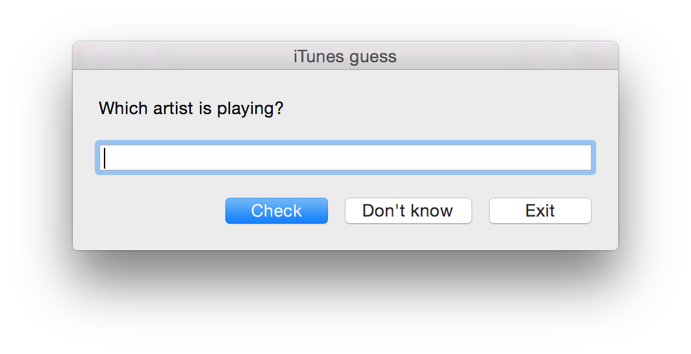

### iTunes guess

Simple guessing game for iTunes written entirely in JavaScript ([JXA](https://developer.apple.com/library/content/releasenotes/InterapplicationCommunication/RN-JavaScriptForAutomation/Articles/Introduction.html)).

#### How to run

1. Clone the repo
2. Either double click `itunes-guess.scpt` and run from AppleScript Editor or execute `./run`
